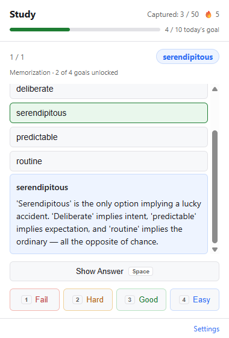
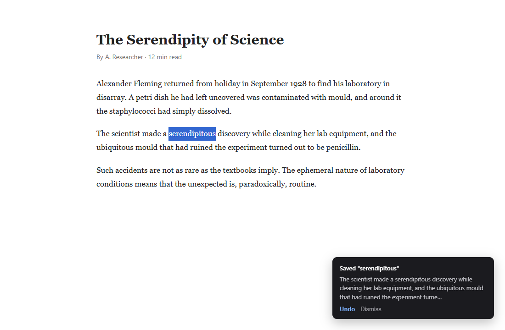
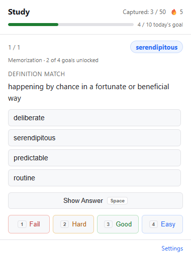
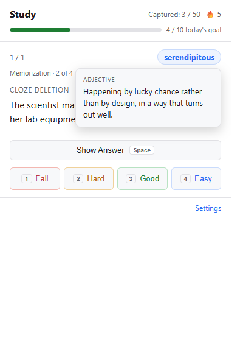
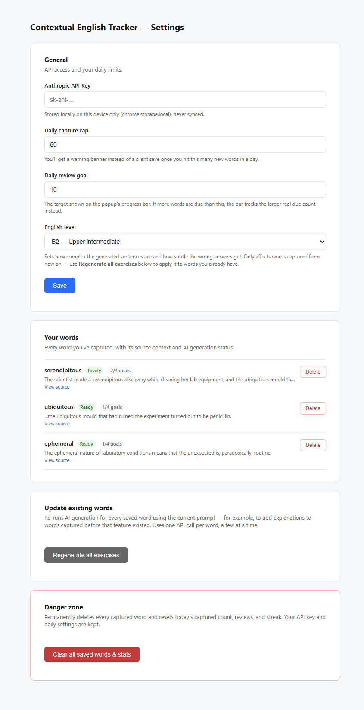
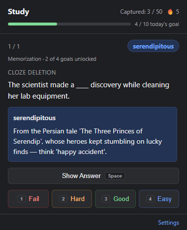

# Contextual English Tracker

A Chrome extension that turns words you meet while reading into spaced-repetition practice. Highlight a word, right-click, and it's saved together with the sentence you found it in. Claude then generates eight different kinds of exercise from that context, and the extension schedules them so you keep meeting the word until you actually know it.

**Status:** early, usable, single-user. Built for personal use — no backend, no account, nothing leaves your machine except the API calls you pay for.

<p align="center">
  
</p>

---

## Why

Most vocabulary apps drill words stripped of context, and most of them test you the same way every time. This one keeps the original sentence, varies the kind of question, and schedules each *kind* of knowledge separately — recognising a definition and producing the word in a sentence are different skills, so they get different review schedules.

## Features

- **Zero-friction capture** — highlight, right-click, "Save Word". An in-page toast confirms what was captured and offers Undo.
- **Context is preserved** — the surrounding sentence is stored with the word and fed to the AI, so exercises use the word the way *you* met it.
- **Eight exercise types** across four learning goals, from recognition through to production.
- **Per-goal spaced repetition** — SM-2 runs independently for each goal, so a word isn't "learned" until you can handle it in all four ways.
- **Difficulty ramps** — goals unlock in order, so a brand-new word is never thrown at you as an open-ended writing task.
- **Explanations, not just answers** — every exercise reveals *why* the answer is right, with memory hooks and notes on what makes distractors wrong.
- **Pitched at your level** — set your CEFR level (A2–C2) and generated material is calibrated to it.
- **Hover for meaning** — stuck before you even start? Hover the word to see its definition and part of speech without revealing the answer.
- **Daily goals and streaks** — a capture cap to stop over-collecting, a review goal with a progress bar, and a streak counter.
- **Word list** — see, inspect and delete everything you've saved.
- **Dark mode**, keyboard shortcuts (`Space` to reveal, `1`–`4` to grade), and a due-count badge on the toolbar icon.

## Requirements

- Google Chrome (or another Chromium browser) with Manifest V3 support
- An [Anthropic API key](https://console.anthropic.com/) — the extension calls the Claude API directly to generate exercises

Without a key the extension still captures words and falls back to a basic cloze exercise, but you won't get the other seven types or the explanations.

## Install (from source)

1. Clone this repository:
   ```bash
   git clone https://github.com/knrl/Contextual-English-Tracker.git
   ```
2. Open `chrome://extensions` and turn on **Developer mode** (top right).
3. Click **Load unpacked** and select the cloned folder.
4. Open the extension's **Settings** (via the popup or the extensions page) and paste in your Anthropic API key.

## How to use it

### 1. Save a word while you read

Highlight any word on any page, right-click, and choose **Save Word**.



A toast confirms exactly what was captured — the word *and* the sentence around it — so you can tell at a glance if it grabbed the wrong thing. **Undo** removes it immediately.

Behind the scenes the extension sends that word and sentence to Claude and builds eight exercises from them. That happens once, in the background, so reviewing is never held up waiting on the API.

### 2. Review when words come due

Click the toolbar icon. The badge on it tells you how many reviews are waiting.

<p align="center">
  
</p>

Each card names the word, which learning goal it's testing, and how far that word has progressed. Answer it in your head, then reveal:

<p align="center">
  
</p>

You get the answer *and* the reasoning — why it's right, and why the near-misses aren't.

Then grade yourself honestly. That's what drives the schedule:

| Key | Button | What it does |
| --- | --- | --- |
| `Space` | Show Answer | Reveals the answer and explanation |
| `1` | Fail | You didn't know it — resets this goal, back tomorrow |
| `2` | Hard | You got there, but it was a struggle |
| `3` | Good | You knew it — the normal path |
| `4` | Easy | Instant recall — pushes the next review out further |

### 3. Stuck? Check the meaning first

Hover the word (or tab to it) to see its definition and part of speech without giving up and revealing the answer.

<p align="center">
  
</p>

This is deliberately unrestricted — grading is on the honour system, so if you needed the hint, grade yourself **Hard** and the schedule stays honest.

### 4. Words unlock gradually

A new word starts with only one goal active: **memorization**. Pass it and **grammar** unlocks, then **paraphrase**, then **usage**. So you meet a word as a recognition task before you're ever asked to produce it in a sentence of your own.

| Goal | Exercise types | What it tests |
| --- | --- | --- |
| Memorization | Cloze Deletion, Definition Match | Do you know what it means? |
| Grammar | The Editor, Correct Form | Can you use the right form? |
| Paraphrase | Paraphrase Rewrite, Synonym Trap | Do you know its precise shade of meaning? |
| Usage | Creative Production, Scenario Response | Can you use it yourself, unprompted? |

Cleared today's queue and still want to practise? **Review more words** pulls in items that aren't due yet.

### 5. Adjust it to you

<p align="center">
  
</p>

Settings is where you:

- paste your **Anthropic API key**
- set your **English level** (A2–C2) — this controls how complex the generated sentences are and how subtle the wrong answers get
- cap how many words you can save per day, and set a daily review target
- browse everything you've saved, with its source page, and delete individual words
- **Regenerate all exercises** — rebuilds every word's exercises with the current settings, e.g. after changing your English level

### Dark mode

Follows your system theme automatically.

<p align="center">
  
</p>

## How it works

```
manifest.json            MV3 manifest

background/
  service-worker.js      Entry point: context menu, messages, due-count badge
  contextMenu.js         Capture flow, duplicate detection, generation batching
  aiClient.js            Claude API call, strict JSON schema, retry + local fallback
  exerciseTypes.js       The eight exercise types, grouped by learning goal
  srs.js                 SM-2, scheduled per (word x goal)
  storage.js             chrome.storage access layer

content/
  sentenceExtractor.js   Pulls the surrounding text block for a selection
  captureToast.js        In-page capture confirmation with Undo

popup/                   Review UI
options/                 Settings, word list, maintenance actions
shared/theme.css         Design tokens, shared by popup and options
```

**Storage.** Saved words and daily stats live in `chrome.storage.local` (10 MB, no per-item cap — each word carries up to eight exercises). Settings live in `chrome.storage.sync` so they follow you across devices. Your API key is kept in `chrome.storage.local` only and is never synced.

**Generation.** Exercises are generated once, at capture time, in a single Claude call per word. Generating at review time instead would mean staring at a spinner every time you open the popup. Interrupted or failed generations are retried automatically when you next open the popup, with bounded concurrency so a large regeneration doesn't trip rate limits.

**Scheduling.** Each word carries four independent SM-2 schedules, one per learning goal. When a `(word, goal)` pair comes due, one of that goal's two exercise types is picked at random.

## Privacy

See [PRIVACY.md](PRIVACY.md) for the full statement. In short: everything is stored locally in your browser, there is no backend and no analytics, and the only data sent anywhere is the word and its surrounding sentence, sent to the Anthropic API to generate your exercises.

## Contributing

Contributions are welcome — see [CONTRIBUTING.md](CONTRIBUTING.md) for how to set up, test and submit changes. Please also read the [Code of Conduct](CODE_OF_CONDUCT.md).

## Security

To report a vulnerability, see [SECURITY.md](SECURITY.md). Please don't open a public issue for security problems.

## License

[MIT](LICENSE) © Mehmet Kaan Erol
